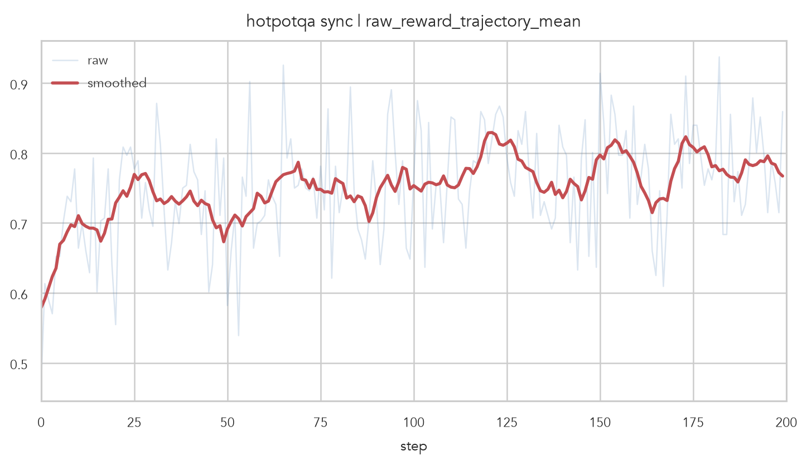
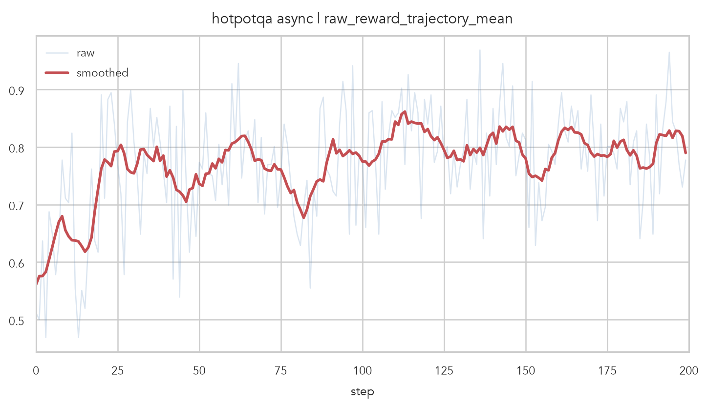
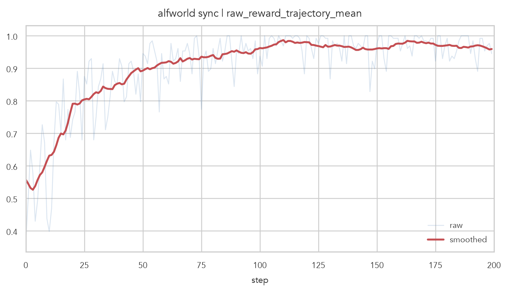
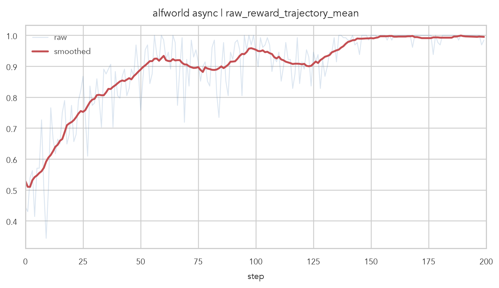

# Recipe Experiments

This directory contains the whitebox agent recipes used for the HotpotQA and
ALFWorld experiments.

For more context, see the recipe guide and the whitebox quick start:

- [Recipe guide](../../docs/recipes.md): how the built-in recipes are organized
  and how to add a new whitebox agent recipe.
- [Whitebox agent quick start](../../docs/whitebox-agent-quickstart.md): setup
  steps for preparing Qwen, HotpotQA, and ALFWorld whitebox training runs.

We ran the provided training scripts for both recipes in synchronous and fully
asynchronous rollout modes. These runs were conducted without staleness control.
For each run, we report `rollout/raw_reward_trajectory_mean`.

## HotpotQA

Scripts:

- `examples/scripts/run_hotpotqa_whitebox_agent_qwen3.5_4b.sh`
- `examples/scripts/run_hotpotqa_whitebox_agent_qwen3.5_4b_async.sh`

## ALFWorld

Scripts:

- `examples/scripts/run_alfworld_whitebox_agent_qwen3.5_4b.sh`
- `examples/scripts/run_alfworld_whitebox_agent_qwen3.5_4b_async.sh`

